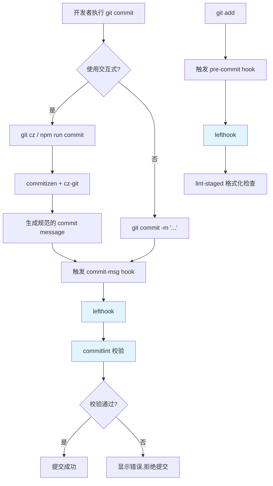
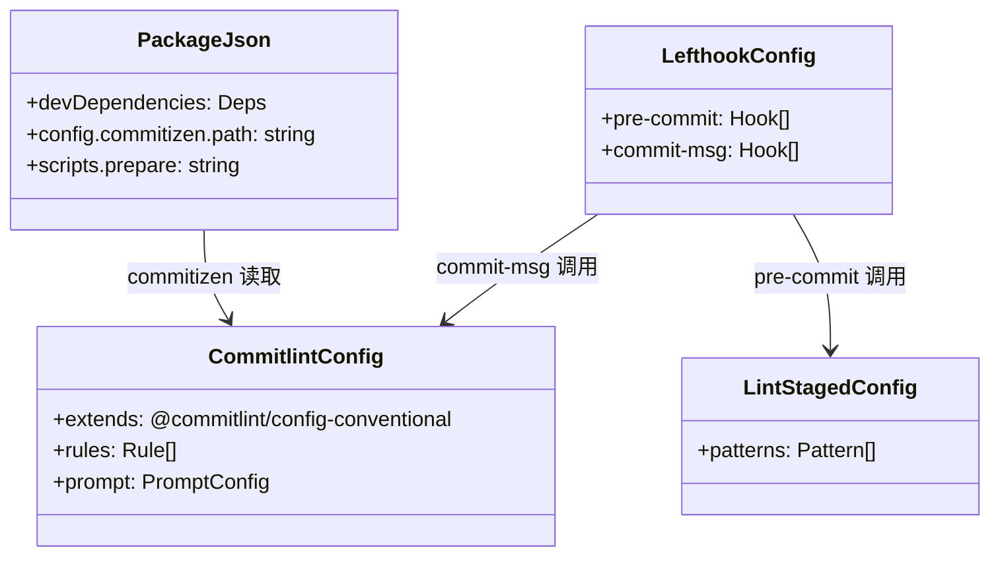
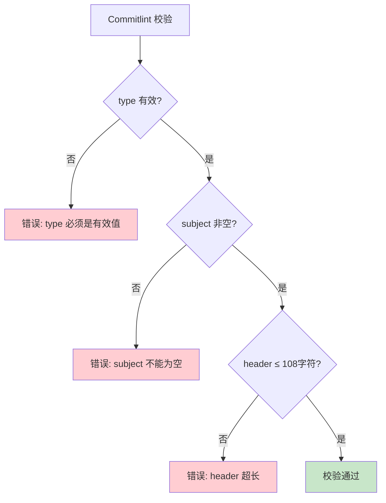

# Commit Lint 集成设计文档

## 1. 概述

本设计描述了如何为 Umi Max 项目集成 commit-lint 功能，包括从 husky 迁移到 lefthook 的完整方案。设计采用 `@commitlint/cli` 进行校验，`commitizen` + `cz-git` 提供交互式提交体验，`lefthook` 管理 git hooks。

## 2. 架构



## 3. 组件和接口

### 3.1 依赖包

| 包名 | 版本 | 用途 |
|------|------|------|
| `@commitlint/cli` | ^17.6.7 | commitlint CLI 工具 |
| `@commitlint/config-conventional` | ^17.6.7 | 约定式提交规范配置 |
| `commitizen` | ^4.3.0 | 交互式提交框架 |
| `cz-git` | ^1.7.0 | 适配 commitizen 的增强插件 |
| `lefthook` | ^2.0.4 | Git hooks 管理工具 |

### 3.2 配置文件

```
project-root/
├── commitlint.config.js    # commitlint 校验规则 + prompt 配置
├── lefthook.yml            # lefthook hooks 配置
├── .lintstagedrc           # lint-staged 格式化配置（保留）
├── package.json            # 依赖 + scripts + commitizen 配置
└── .husky/                 # 删除此目录
```

### 3.3 接口关系



## 4. 数据模型

### 4.1 Commitlint 配置结构

```javascript
// commitlint.config.js
{
  ignores: [(commit) => boolean],           // 忽略规则
  extends: string[],                        // 继承的配置
  rules: {
    'body-leading-blank': [level, always],
    'footer-leading-blank': [level, always],
    'header-max-length': [level, always, 108],
    'subject-empty': [level, never],
    'type-empty': [level, never],
    'subject-case': [level],
    'type-enum': [level, always, string[]] // 允许的提交类型
  },
  prompt: {
    messages: { key: string },              // 中文提示信息
    types: [{ value, name, emoji }],        // 提交类型选项
    useEmoji: true,
    allowCustomScopes: true,
    allowEmptyScopes: true,
    // ... 其他 prompt 配置
  }
}
```

### 4.2 Lefthook 配置结构

```yaml
# lefthook.yml
pre-commit:
  parallel: true
  commands:
    check:
      glob: "*.{js,ts,cjs,mjs,d.cts,d.mts,jsx,tsx,json,jsonc}"
      run: npx @biomejs/biome check ... {staged_files}

commit-msg:
  commands:
    commitlint:
      run: npx commitlint --edit {1}
```

### 4.3 Commit Message 格式

```
<type>(<scope>): <subject>

<body>

<footer>
```

**示例:**
```
feat(auth): 添加用户登录功能

- 新增登录表单组件
- 集成 JWT 认证
- 添加登录状态管理

closed: #123
```

## 5. 错误处理

### 5.1 Commitlint 校验失败



### 5.2 降级策略

- 如果 commitlint 未安装，hook 应优雅失败（显示警告但允许提交）
- 开发者可以通过 `git commit --no-verify` 跳过 hook 检查

## 6. 测试策略

### 6.1 单元测试

测试项：
- 各种有效的 commit message 格式
- 各种无效的 commit message 格式
- 边界情况（空 message、超长 header、无效 type）

### 6.2 集成测试

测试项：
- `git cz` 交互式提交流程
- `git commit` 直接提交的校验
- `git commit --no-verify` 跳过校验
- pre-commit 格式化检查

### 6.3 测试命令

```bash
# 测试 commitlint
echo "feat: test commit" | npx commitlint

# 测试交互式提交
npx git cz --dry-run

# 测试 lefthook
lefthook run pre-commit
lefthook run commit-msg
```

## 7. 迁移步骤

### 7.1 移除 Husky

1. 卸载依赖: `pnpm remove husky lint-staged`
2. 删除目录: `rm -rf .husky`
3. 更新 package.json: 移除 `prepare: husky` 脚本

### 7.2 安装新依赖

```bash
pnpm add -D @commitlint/cli @commitlint/config-conventional commitizen cz-git lefthook
```

### 7.3 创建配置文件

1. 复制 `commitlint.config.js`（参考 single 项目）
2. 复制 `lefthook.yml`（参考 single 项目，调整 pre-commit 命令）

### 7.4 更新 package.json

```json
{
  "scripts": {
    "prepare": "husky",        // 删除
    "prepare": "lefthook install"  // 新增
  },
  "config": {
    "commitizen": {
      "path": "node_modules/cz-git"
    }
  }
}
```

### 7.5 安装 Hooks

```bash
npx lefthook install
```

## 8. 设计决策

| 决策点 | 选择 | 理由 |
|--------|------|------|
| Git Hook 工具 | lefthook | 性能更好，配置更简洁，支持并行 |
| 提交互工具 | commitizen + cz-git | cz-git 提供更好的中文支持和自定义能力 |
| 规范基准 | Conventional Commits | 行业标准，工具生态完善 |
| Scope 处理 | 允许自定义或留空 | 灵活性与规范性的平衡 |
| Emoji | 启用 | 提升 commit 历史的可读性 |
| Header 长度 | 108 字符 | GitHub UI 友好，与参考项目一致 |

## 9. 后续扩展

- 可集成 `standard-version` 自动生成 CHANGELOG
- 可集成 Semantic Release 自动发布版本
- 可添加自定义 scope 选项
- 可配置团队特定的提交类型
